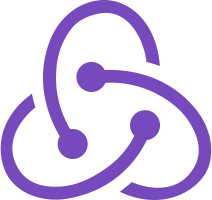

# React / Redux Workshop Series

React + Redux are highly in demand front end web technologies. Through this series of 2 hour workshops in hosted in Providence, you will become proficient in using both. The workshops will also teach ES6 Javascript concepts to extend your capabilites in Javascript, as well as provide resources for each topic that will allow you to dive as deep as you want into the nitty gritty details.

**Modular Workshops and Arcs**

You can elect to take the entire [React workshop arc](#react-workshop-arc), the entire [Redux Arc](#react-workshop-arc), or both. Taking an entire arc will be the most comprensive way to learn Redux and/or React. You may also elect to take only take workshops that you are interested in. Within each arc, the workshops build conceptually off of previous material. However, each individual workshop is designed so that the code for that workshop can be run in isolation.

### Please check out the sections below for more details about the workshops!

---
## Contents

**[Prerequisites](#prerequisites)**

**[Location and Instructor](#location-and-instructor)**

**[Class Structure](#class-structure)**

**[React Workshop Arc](#react-workshop-arc)** 

**[Redux Workshop Arc](#redux-workshop-arc)** 

**[Enrollment](#enrollment)**

---

## Prerequisites

> IMPORTANT: If it is your first time taking one of these workshops, you must send your GitHub username to the [Instructor](#location-and-instructor) prior to the class

**Technology**
* a Mac or Windows 10 laptop with the following installed:
   * [git](https://git-scm.com/)
   * [node](https://nodejs.org/en/)
   * a [GitHub](http://www.github.com) account
   * [Visual Studio Code](https://code.visualstudio.com), [Atom](https://atom.io), or [Sublime Text](https://www.sublimetext.com)

**Coding Experience**
* proficiency with:
  * Javascript
  * HTML
  * CSS
  * command line utils
  * git/GitHub

---

## Location and Instructor

**Location**  
*In Providence; exact location TBA*

**Instructor**   
Arjun Ray  
deconstructionalism@gmail.com

Arjun spent many years in academia working on neuroscience and genomics research before switching to programming, which has proven to be much more rewarding for him. He codes in Python, R, Perl, Ruby, Javascript, and a few other languages, and loves writing elegant, reusable code as well as trying to wrap his brain around low level programming languages and high level computer science concepts. His coding expertise lies in fullstack web application development, probabilistic modeling, data visualization, and statistical inference. He's been a professional touring musician, a recording studio owner/engineer, a teacher, an art curator and music festival organizer over the years. He also loves cooking, creative writing, long distance biking, pretty much all animals, and long comma-separated lists of nouns. He aims to become the best teacher that he can be as well as test the limits of his own knowledge.

---

## Class Structure

Each workshop will be 2 hours long. The workshops will consist of the following:
> NOTE: ~90% of workshop time will be focused on Lecture and Coding Excersizes

* **Lecture**   
  the main concepts of the lesson will be covered here. slides, whiteboarding, and live coding will be used
* **Coding Excersizes**  
  you will perform coding excersizes individually or in groups to practice applying concepts from the lecture
* **Q&A**  
  you will have an opportunity ask the instructor to go back and explain confusing material, or you can ask to get a more detailed understanding about concepts that interest you 
* **Eval**  
  you  will be asked to fill out a quick form at the end of the lesson to help us improve the workshops based on your input
* **Afterwork**  
  you will be provided with code problems and solutions so that you can further test your understanding of the workshop concepts outside of the class. Afterwork is not required. It is there for your benefit if you choose to do it!

---

## React Workshop Arc

**Description**

[React](https://reactjs.org/) is a Javascript frontend library for building rich, modular, reactive web interfaces. React is arguably the most popular frontend technology in modern web development and comprehensive understanding of React is highly sought after in the job market. 

React imposes hierarchical structure on how front end design is implemented, requiring more forethought than throwing pieces of GUI together in any which way. React also has some idiosyncratic conventions that may not be intuitive at first glance.

Through this series of workshops, students with little-to-no knowledge of React will learn the library in detail, as well as build and extend projects using the technology. 

**Schedule**

| Title | Topics Covered | Date |
| --- | --- | --- |
| [What is React?]() | text | *TBA* |
| [Organizing Your Project]() | text | *TBA* |
| [Routing]() | text | *TBA* |
| [React from Scratch?]() | text | *TBA* |
| [Immutability, Proptypes and Type-Checking]() | text | *TBA* |
| [Styling]() | text | *TBA* |
| [HTTP Requests]() | text | *TBA* |

---

## Redux Workshop Arc

### Description

[Redux](https://redux.js.org/) is an architectural pattern for handling the state of an app, which allows for apps to behave in a consistent predictable way, even when scaled up to large size or used in different context. While redux itself is just a pattern, `redux` is a package that implements the pattern in a way that can be used with React.

Redux imposes a uni-direction data-flow pattern that encapsulates changes in state and handling of external side-effects in a highly structured way. Because of this structure, there is one and only one right way to implement state changes in an app, which makes the app much more easily debuggable, fault tolerant, and scalable. Because Redux enforces the more general concepts of immutability, flux architecture, and functional programming, having Redux experience can elevate a job candidate's hireability even in locations where Redux is not used. 

This set of workshops is designed to allow students with proficiency in React to be able to understand and implement Redux on their future React projects.

**Additional Prerequisites**
* proficiency with React

| Title | Topics Covered | Date |
| --- | --- | --- |
| [What is Redux?]() | text | *TBA* |
| [Data Flow]() | text | *TBA* |
| [Routing, Middlewares and Side-effects]() | text | *TBA* |
| [Getting and Setting State]() | text | *TBA* |

---

## Enrollment

*Payment method TBA*
